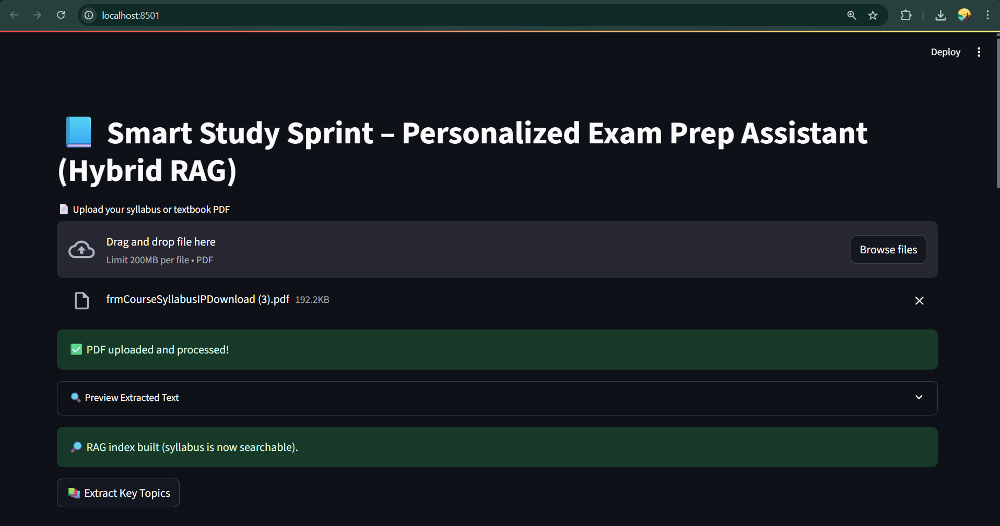
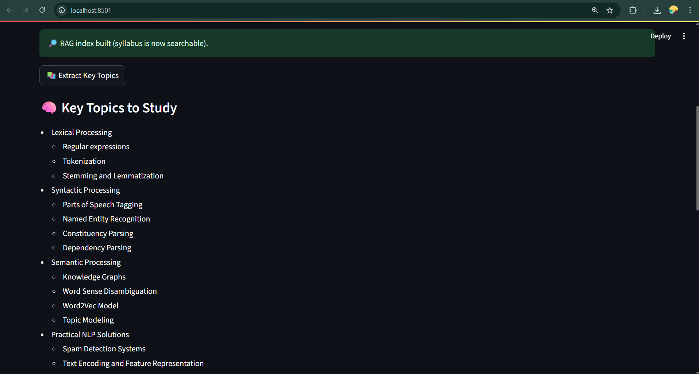
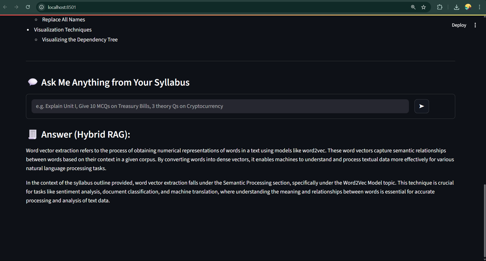

# Smart Study AI Sprint 📚🤖

**Personalized Exam Preparation Assistant powered by AI**

Smart Study AI Sprint is a next-generation study companion designed to make exam preparation faster, smarter, and more efficient. It allows students to upload their syllabus or textbooks and get instant, intelligent answers, summaries, and practice questions using advanced AI techniques.

---

## How It Works

1. **Upload PDF**  
   Users upload their syllabus or textbook PDF directly into the app.

2. **PDF Reading & Preview**  
   The app extracts text from the first few pages and provides a quick preview.

3. **Content Chunking & Indexing (RAG Index)**  
   - Reads the PDF page by page.  
   - Detects headings like “Unit I”, “Unit II” to tag chunks.  
   - Splits text into smaller chunks for processing.  
   - Converts chunks into vector embeddings using OpenAI embeddings.  
   - Stores chunks in a Chroma vector database for fast semantic search.

4. **Key Topics Extraction**  
   Automatically identifies main topics and subtopics from the syllabus using AI summarization.

5. **Ask Me Anything Interface**  
   - Users can ask questions in natural language.  
   - System retrieves the most relevant chunks from the syllabus (RAG).  
   - Answers are grounded in the syllabus or fallback to domain knowledge.  
   - Generates multiple output types: concise explanations, MCQs, theory questions with answers.

6. **Output**  
   Answers are displayed with references like `[Unit, Page]` for easy revision.

---

## Problem Statement

Students often struggle with:

- Lengthy and complex syllabi or textbooks.  
- Time-consuming manual searches for relevant information.  
- Creating personalized study materials (summaries, MCQs, key topics).  

Existing tools rarely combine **syllabus-specific retrieval** with **AI-powered question answering**, which Smart Study AI Sprint solves elegantly.

---

## Technologies Used

- **Backend & AI**: Python, OpenAI GPT, Retrieval-Augmented Generation (RAG)  
- **Frontend**: Streamlit  
- **Database**: Chroma (vector database for embeddings)  
- **Other**: PDF processing libraries, tokenization & chunking algorithms  

---

## Why This Project Stands Out

- Fully personalized study assistant.  
- Contextually accurate answers tied to syllabus content.  
- Automated key topic extraction and practice question generation.  
- Bridges the gap between AI content generation and syllabus-specific learning.  

---

## App Screenshots

Here’s how the app looks in action:

<table>
  <tr>
    <td></td>
    <td></td>
    <td></td>
  </tr>
</table>

---

## Usage

1. Run the Streamlit app:

```bash
streamlit run main.py
